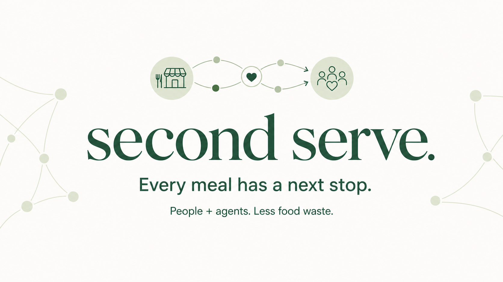

# Second Serve

**Every meal has a next stop.** A food-rescue planning workspace for people and their browser agents, built for the WebMCP Challenge 2026.

**[Open the live app](https://second-serve-rescue.therealaamod.chatgpt.site)**



[Download the narrated 2:23 demo](submission/second-serve-demo.mp4) · [Submission text](submission/DEVPOST.md) · [Validation record](submission/VALIDATION.md)

A coordinator knows which commitments matter. An agent can compare constraints and explore alternatives. Second Serve lets them work in one shared browser state: propose, review, protect, disrupt, and replan.

## Quick start

Node.js 22.13+ (Node 24 recommended), npm.

```sh
npm ci
npm run dev
```

Open the printed localhost URL. No account, paid service, or API key is required for the built-in planner. For agent interaction, use a browser that exposes imperative WebMCP (ChatGPT in-app browser or a compatible Chrome build with WebMCP enabled).

```sh
npm test
npm run typecheck
npm run build
```

## The 90-second walkthrough

1. Start with six fictional donors offering 480 portions to five fictional kitchens.
2. Ask the browser agent: “Read the workspace and stage an earliest-expiry rescue plan for my review.” Or click **Build rescue plan** to run the deterministic planner directly.
3. The proposal matches 480 portions. Click **Approve plan**.
4. Protect **The Green Kitchen → Hope Community**, the 120-portion commitment.
5. Click **Simulate capacity drop**. Open Table can now take only 30 portions. Existing assignments are visibly flagged.
6. Ask the agent to replan without changing protected commitments. A feasible plan matches 410 portions, preserves the protected 120, and explains the 70-portion shortfall.
7. Review and approve, then download a CSV handoff. No deliveries are dispatched.

## Actual WebMCP integration

`lib/use-rescue.ts` registers six imperative tools once per mounted document, using `document.modelContext.registerTool(...)` with a `navigator.modelContext` compatibility fallback. Registration is feature-detected and cleaned up using AbortSignal and unregisterTool when available.

| Tool | Effect |
| --- | --- |
| `get_workspace` | Read offers, kitchens, commitments, proposal, revision, recent audit |
| `preview_plan` | Read-only what-if calculation, including hypothetical capacities |
| `stage_plan` | Put a computed proposal on the visible board for human review |
| `update_kitchen_capacities` | Atomically update declared capacities and invalidate drafts |
| `explain_match` | Explain exact eligibility/rejection reasons for a pair |
| `export_approved_manifest` | Read human-approved handoff rows and any new conflicts |

Each tool has a JSON Schema, descriptions, read-only annotations, and runtime validation. The agent and UI share the same store. Mutations require `expected_revision`, preventing an agent from overwriting intervening human changes. Errors are structured and leave state unchanged. Tools return only after the shared React state is flushed.

Approval and unlocking are intentionally UI actions. Tool annotations are hints, not an authorization boundary. A general browser agent can still use UI controls; the design reserves those controls for a coordinator's review rather than claiming a security boundary.

### Example agent instructions

> Read my Second Serve workspace. Compare rescuing the earliest-expiring food with minimizing travel. Explain any meals left unassigned, then stage the earliest-expiry plan for my review. Preserve all protected commitments.

After the human approves and protects the first assignment:

> Open Table can only receive 30 portions. Update its capacity, explain the resulting conflicts, then stage a new earliest-expiry plan. Preserve my protected commitments and explain anything left over.

## Why this needs WebMCP

The important context lives in the page: the coordinator's protected quantities, current draft, changes since the last proposal, and local constraints. Browser agents receive that exact state through task-oriented tools, and their proposals appear directly in the review surface. There is no duplicated MCP backend, screen-scraped table, hidden chat simulation, or separate agent copy of the plan.

## Solver and boundaries

`lib/rescue.ts` implements integral min-cost maximum flow using shortest augmenting paths and residual edges. It maximizes portions subject to donor supply, receiving capacity, compatible diets, declared allergen exclusions, estimated travel limit, donor window, and kitchen closing time. Protected quantities are reserved first; infeasible protected commitments fail explicitly.

Both objectives maximize assigned portions. `rescue` then minimizes a weighted urgency-plus-travel cost (minutes until deadline × 100 plus travel minutes per portion); `distance` minimizes portion-weighted estimated travel. This is an allocation optimizer, **not a vehicle-routing system**. Splitting offers is allowed. It assumes independent transport capacity for each assignment and does not schedule drivers, handle cold chains, or verify food safety. Travel uses illustrative 0–100 coordinates and `ceil(5 + distance × 0.42)`, not roads, geocoding, or live traffic.

The 480/410/120 results are reproducible **sample-scenario outputs**, not measured real-world impact. All names and offers are fictional.

## Local data and import

Dataset inputs are saved only in localStorage in this browser. No backend receives the rescue dataset. Reload restores validated donor/kitchen inputs and scenario settings, but deliberately clears plans, locks, and history for fresh review. Undo retains 20 changes in the current session; the audit displays up to 50 events. Export data for a portable copy. Browser storage failure falls back to session-only operation.

**Bring your own data** accepts strict JSON with 1–40 donors and 1–40 kitchens. Load the example in the app or use `examples/demo-dataset.json`. Times are minutes after midnight; coordinates are integers from 0 to 100. IDs must be unique within their collections. Imports replace the local workspace and can be undone. Labels are rendered as text; CSV cells guard against spreadsheet formula prefixes.

## Source guide

- `app/page.tsx`: board, network diagram, review, kitchens, import/export, activity
- `app/globals.css`: responsive visual design
- `lib/rescue.ts`: pure solver, constraints, input validation
- `lib/store.ts`: shared transitions and tool contracts
- `lib/use-rescue.ts`: browser registration and React binding
- `tests/rescue.test.mjs`: allocation, constraints, failures, transactions, revisions
- `submission/`: Devpost copy, demo script, and submission checklist

Production is a static export in `dist/client/`, served through Sites. No server runtime bundles or server-action endpoints are deployed. Built with React 19, TypeScript, Vinext/Vite, shadcn/Base UI, Lucide, and Sites/Cloudflare-compatible hosting. MIT licensed. Social preview generated with OpenAI ImageGen; icons use Lucide's ISC-licensed library. Third-party packages retain their respective licenses.

## Challenge references

- [Official challenge](https://openai.com/webmcp-challenge/)
- [Devpost requirements](https://webmcp.devpost.com/)
- [Official rules](https://webmcp.devpost.com/rules)
- [WebMCP specification](https://webmachinelearning.github.io/webmcp/)

Submission materials distinguish implemented features from limitations. No prizes or adoption are promised.
